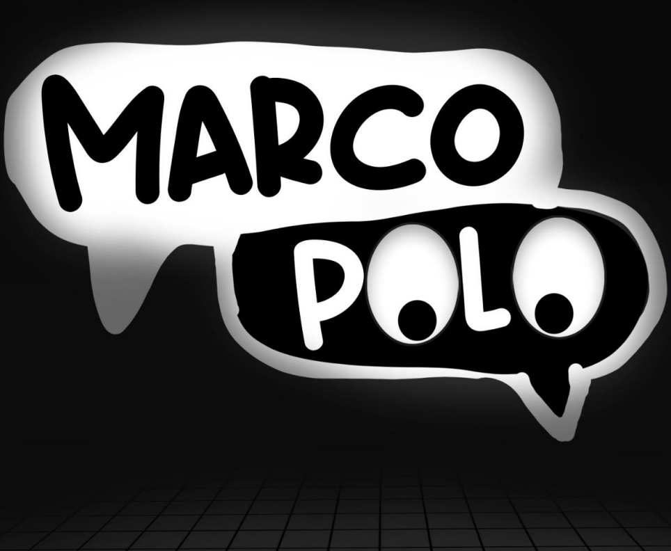
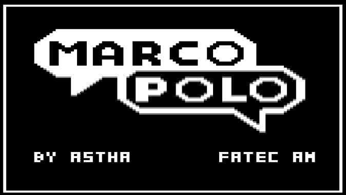
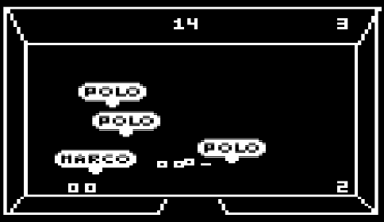
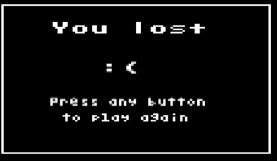
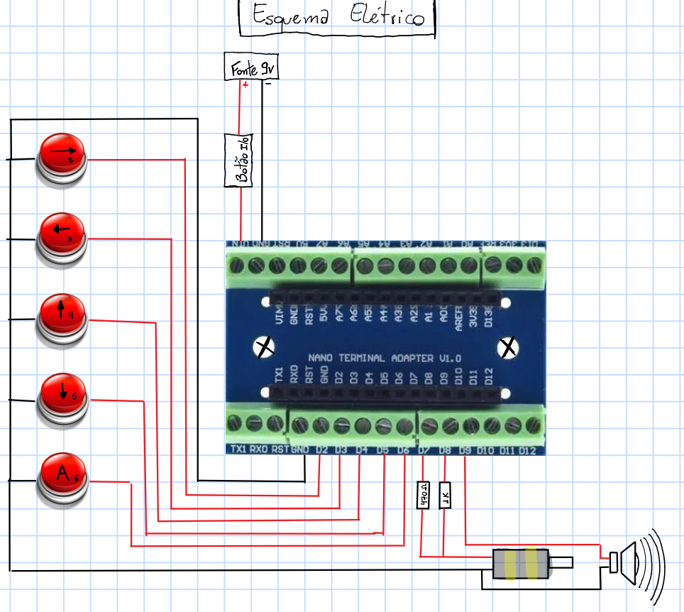
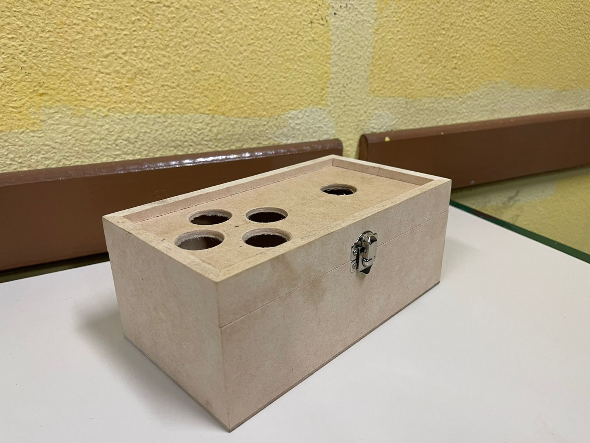
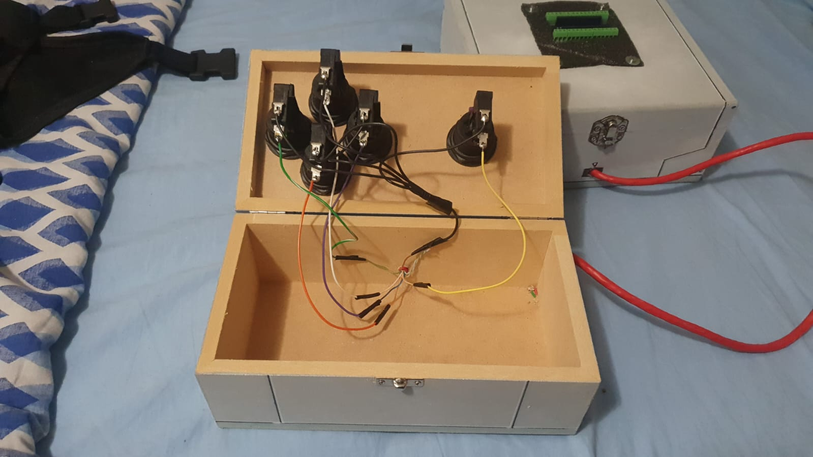
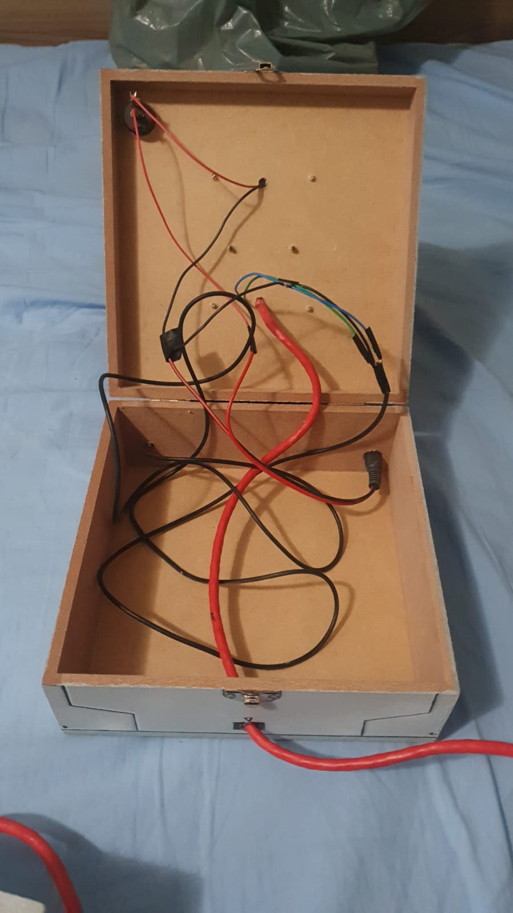
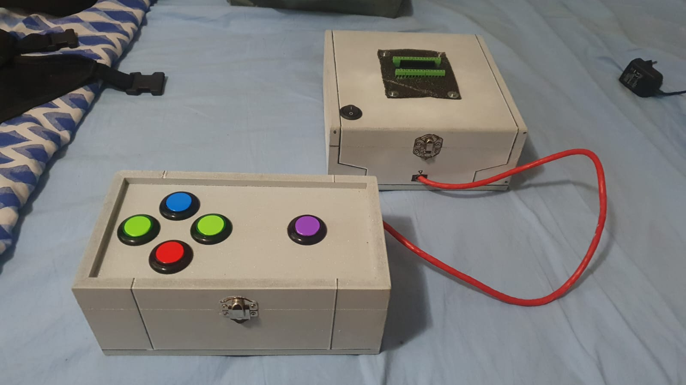
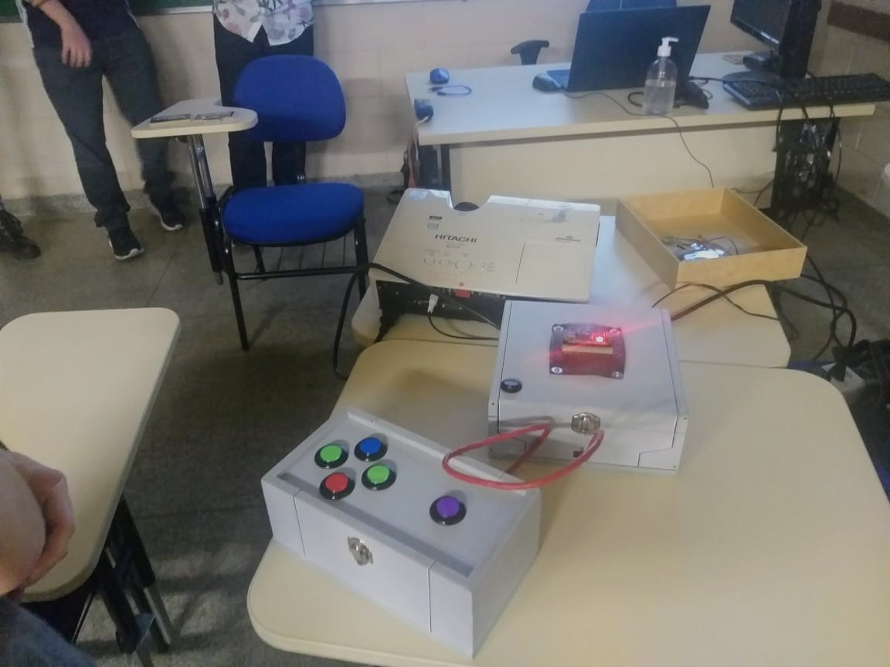

<h1 align="right">
  
  Marco Polo
</h1>


<p align="right">
  Game developed for the discipline of Console Games
  <br><br>
  <!-- License -->
  <a>
    
  </a>
</p>
<br>

## 🎮 Overview game

> **Note**:
> Play on Wokwi: https://wokwi.com/projects/346622230205039186

> **Note**:
> The Wokwi simulator has some performance issues so the game may look broken or the image is low quality, but on real hardware it works fine!

<table>
  <tr>
    <td>
      
    </td>
    <td>
     
    </td>
    <td>
      
    </td>
  </tr>
</table>


## 💾 Overview hardware

<table>
  <tr>
    <td>
      
    </td>
    <td>
      
    </td>
    <td>
      
    </td>
  </tr>
  <tr>
    <td>
      
    </td>
    <td>
      
    </td>
    <td>
      
    </td>
  </tr>
</table>

## :open_book: About 
The game's central idea is a children's game called "marco polo", where the player needs to find
your friends in the dark.

When the lights are turned off in the game, friends go to random places inside their own room, the only visible thing is the character's eyes.

When the character finds a friend, that friend's eyes appear. If it is difficult to find other friends, the player can press the action button (in Wokwi it is the red button, in the real console it is the purple button) and the positions of the other friends will be revealed, for a short period of time, where the character main says "Marco" and the friends "Polo".

The ultimate goal of the game is to find all the kids before time runs out (the timer is in the top center of the game).

This project contains a game developed from the Console Games discipline in [FATEC Americana](https://www.fatec.edu.br/).

## :bricks: This project was built with: 
- [Arduino Uno](https://www.arduino.cc/)
- [TVOut](https://github.com/Avamander/arduino-tvout)
- [Wokwi](https://wokwi.com/)

## 🏄‍♂️ Quick Start
 1. Clone this repository `git clone https://github.com/coetus-jd/console-game.git`
 2. Enter in the project's folder: `cd console-game`
 3. Run whatever project you want 😃
 
## :recycle: Contribute
 1. Fork this repository
 2. Create a branch with your feature: ```git checkout -b my-feature```
 3. Commit your changes: ```git commit -m 'feat: My new feature'```
 4. Push your branch: ```git push origin my-feature```
 
## :handshake: Contributors
 - [Alberto Luigi Venciguerra](https://www.instagram.com/alvenciguerra/) - Graphic Design, Level Design, Adminstration 
 - Ana Laura - Graphic Design and Level Design 
 - [Bruno Ganade Alves ](https://github.com/Ganade) - Hardware
 - Bruno Miguel Degasperi Serra - Graphic Design and Level Design 
 - [Fabrício Pinto Ferreira](https://github.com/pferreirafabricio) - Coding and testing
 - [Gustavo Antônio Mioto](https://github.com/gustavoamioto) - Coding and testing
 - [Leonardo Rezende Nakashima](https://github.com/waterwhirl) - Coding and testing
 - Lucas Bocatto - Graphic design and Level Design
 - [Mateus Peres](https://github.com/j00ji) - Coding and testing
 - Matheus Rodrigues Mantovani - Documentation

## :page_with_curl:	License
This project is under the GPL-3.0 license. Take a look at the [LICENSE](LICENSE) file for more details.

## 📚 Learn more
  * https://circuitstate.com/tutorials/how-to-use-vs-code-for-creating-and-uploading-arduino-sketches/#Workspace
  * https://www.arduino.cc/en/software
  * https://www.npmjs.com/package/clang-format
  * https://www.mischianti.org/images-to-byte-array-online-converter-cpp-arduino/

<br/>
<p align="center">
 
</p>
